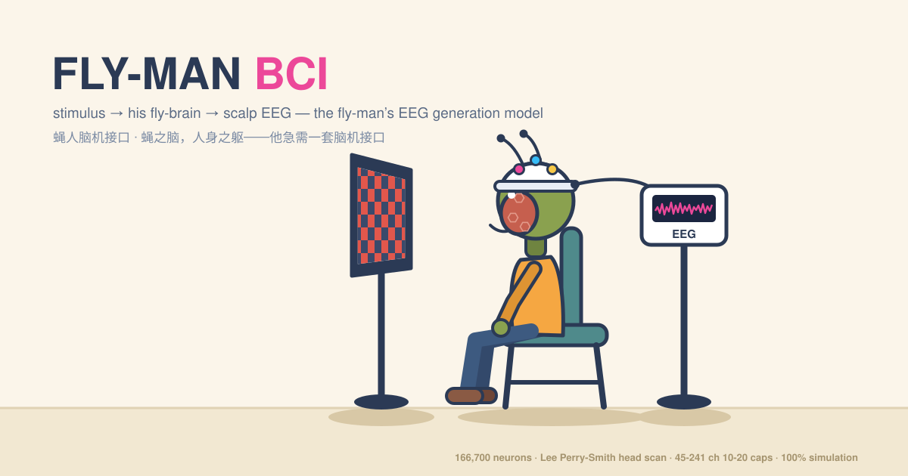
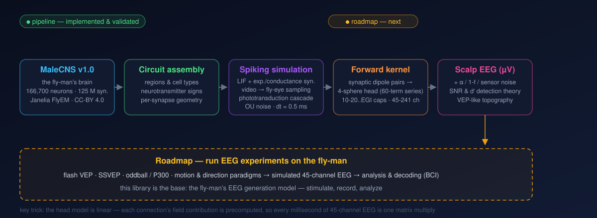

<div align="center">



# 🪰 蝇人脑机接口 · Fly-Man BCI

**人身之中，一颗果蝇的大脑——以及他急需的一套脑机接口。**

*本仓库打造的是基座：蝇人的脑电生成模型——
外部刺激 → 神经网络活动 → 头皮电极采集到脑电。*

[English](README.md) · **简体中文**

▶ **[在线演示](https://whiteram.github.io/fly-man-bci/viz/)** ——
交互式 3D 回放页面直接由本仓库驱动（若链接未生效，需在 GitHub
Settings → Pages 选 main /(root) 开启；也可本地起服务运行 `viz/`）。


</div>

---

## 设定

有一个蝇人：在一场传送事故中（你可能看过那部电影），他的大脑神经网络变成了果蝇的
连接组——果蝇是唯一拥有完整大脑接线图的动物——而他的身体还是人的。感官都还在，
可是一套果蝇的运动系统很难驱动一具人的身体。他急需一套脑机接口。

要给他做 BCI，得先有一件更基础的东西：**他的脑电模型**——他的大脑活动在头皮上
是什么样子。这就是本项目。

## 模型：蝇人的脑电生成模型

> **外部刺激 → 果蝇脑神经网络 → 头皮脑电**

人头模型中装着一个果蝇脑神经网络。对他的眼睛闪光，看网络放电，算出细胞外电流，
从他的头皮上读出脑电。



| 组成 | 内容 |
|---|---|
| **大脑** | 真实果蝇连接组——[MaleCNS v1.0](https://male-cns.janelia.org/)（HHMI Janelia，CC-BY 4.0；Berg et al., *Cell* 2026），166,700 神经元 / 约 1.25 亿突触——跑仿真动力学：LIF 神经元按**真实的突触数量与神经递质符号**接线，眼中是光转导级联，外加轴突延迟与背景噪声；0.5 ms 步长；全 CNS 模式实测约 15 万神经元 / 约 6,400 万突触。 |
| **眼睛** | 刺激可以是真实的人类视频：灰度 + 小网膜点扩散模糊 → 分位数归一化 → 每眼整幅眼平面采样（双眼各采样一份完整、同向的图像）→ 逐受体亮度进入级联（合成 1/f 闪烁与漂移纹理协议也内置）。 |
| **头** | 几何：**Lee Perry-Smith 三维头部扫描**（CC-BY 3.0，经 three.js 素材分发）。物理：经典四球壳模型（脑 / 脑脊液 / 颅骨 / 头皮；文献半径与电导率）——每份突触电流是一个源-汇偶极，60 阶勒让德展开把场传到头皮。 |
| **脑电** | 可切换的国际 10-20 系电极帽：**45 导（10-20）· 64 导（10-10）· 128 导（10-5）· EGI HydroCel 256**（241 个可用位点），1 kHz 采样；可叠加背景脑电用于对照（α 节律、1/f 活动、传感器噪声——注：项目前提是果蝇网络**替代**人脑，神经源性背景本不存在，该叠加是"与完好人脑共存"的反事实情景；设备噪声才是默认地板）；SNR 与 d′ 检测分析。 |

一条几何脚注：蝇网络整体放大（×202）以填满人头——纯几何，假设不改变放电。

## 为什么人头重要

蝇自己的头是一个密封绝缘体：解一下物理就知道，其外部电场**严格为零**——苍蝇的脑
活动从外面永远测不到。而人头（导电的脑、绝缘的颅骨、导电的头皮）恰好让信号出得来。
蝇人的人身不是摆设——正是它让"蝇人的脑电"成为可能。

## 仿真已经展示了什么

- 他的视觉系统仅凭接线就涌现出运动方向选择性——连接组无人教，自己"看得见"运动。
- 他的头皮拓扑与人类 VEP 直觉一致：后部电极最强，对极电极反相关（−0.98）。
- 他的刺激锁相信号随视野驱动面积缩放：全场自然闪烁协议下约 0.84 µV 对 2.8 µV
  背景——最佳通道（T7）约 **46 次试验平均**即可读出；换成稀疏的演示视频（一个
  小物体在动）降到约 0.2 µV、约 1,200 次。真实、可量化，而且对代价诚实。
- 管线先通过了蝇尺度的基准：对眼睛闪光，得到教科书级果蝇 ERG。

## 仓库结构

```
src/ffbm/          仿真引擎：连接组数据访问、向量化脉冲级联、球壳前向核、
                   校准与区域可选装配、参数注册表
experiments/       研究日志 exp001–exp017（每实验自带 README：设计/结果/局限）
viz/               交互式 3D 演示 + 其背后的数据导出管线（双语界面，默认英文）
docs/              方法学与使用文档（中文原版）
docs/en/           上述文档的英文版
scripts/           数据下载 / 装配 / 剖析工具
tests/             单元测试（前向核、标定、装配、参数）
tools/             横幅 / 管线图生成器
assets/            README 插图
```

快速开始：Python 3.12 + NumPy/SciPy/pandas/pyarrow；下载连接组（约 14 GB，
公开直链、无需注册，见 `docs/data.md`）；`pip install -e .`；`pytest tests/`；
本地起服务 `python -m http.server 8613 -d viz` 打开 `index.html`。
完整工作流见 `docs/USAGE.md`。

## 路线图：作为脑电实验的基座

本代码库是基座——蝇人的脑电生成模型。在它之上，任何人类 EEG 实验范式都可以作为
刺激协议运行：

**范式 → 仿真大脑 → 仿真 45 通道脑电 → 分析 / 解码（BCI）**

- **闪光 / 图形 VEP** —— 诱发电位，最简单的信道
- **SSVEP** —— 频率标签的选择信道
- **Oddball / P300 式** —— 稀疏偏差响应
- **运动与方向** —— 他视觉系统的方向机器
- **高密度电极帽** —— 已完成：10-20（45 导）· 10-10（64 导）· 10-5（128 导）· EGI 256（241 位点）
- **GPU 加速** —— 已完成：生物学循环+前向记录整段上 GPU（`--gpu`，CuPy/NVRTC），47 min → 156 s 且轨迹逐位一致；分阶段构建缓存让热导出（换刺激/换电极布局）端到端 ~2.5 min（见 `docs/ACCELERATION_PLAN.md`）
- **闭环** —— 解码输出回馈到刺激

## 引擎近况

三层加速、每层都与 CPU 基线对拍验证：numba JIT 热点内核（2.38×）、GPU
常驻引擎 `--gpu`（生物学循环+前向记录 **47 min → 156 s，约 18×**，轨迹
逐位一致）、分阶段构建缓存（电路键 = 区域/数据/代码；前向核键 = 电极
布局——换帽配置只重建核这一级）。全 CNS 导出（150,601 神经元 / 45 导 /
10.5 s）在 16 核台式机 + RTX 4060 Ti 上冷跑 ~7.5 min、热跑 ~2.5 min。
要求：Python 3.12，NumPy / SciPy / pandas / pyarrow（电极与视频工具另需
MNE-Python 和 imageio/PyAV；加速层需 numba + cupy-cuda12x）；连接组下载
约 14 GB（公开直链、无需注册）；完整管线建议 16 GB 以上内存。

## 诚实声明

- 蝇人是虚构的；连接组、头部物理与脑电工程标准是真实的。这是一个建立在真实数据上
  的思想实验。
- ×202 放大只是几何——真实的神经元放大 202 倍无法工作。
- 神经元动力学是校准过的近似，匹配文献放电率窗口；绝对幅值是量级可信。

## 致谢与声明

这个小舞台搭在许多人的工作之上，一切署名如下：

**大脑——数据**

- **MaleCNS v1.0** 雄性果蝇中枢神经连接组 — Berg et al., *Cell* (2026)，
  HHMI Janelia FlyEM，https://male-cns.janelia.org/ — **CC-BY 4.0**

**头——几何与电极**

- **3D Head Scan by Lee Perry-Smith / Infinite-Realities** — **CC-BY 3.0**；
  电极帽所在的真人头部网格，因 three.js 官方示例素材而广为人知
- **国际 10-20 电极放置系统** — H. H. Jasper，*Electroencephalogr. Clin.
  Neurophysiol.*（1958）
- **10-10"百分之五"扩展** — Oostenveld & Praamstra，*Clin. Neurophysiol.*（2001）

**物理与所依赖的科学**

- Rush & Driscoll（1969）；Nunez & Srinivasan，*Electric Fields of the Brain* —
  四球壳前向核背后的球形体积传导模型
- Lappalainen et al., *Nature* (2024) — 连接组约束的果蝇视觉网络（`flyvis`）
- Shiu et al., *Nature* (2024) — 全连接组 LIF 仿真
- Wang-Chen et al., *Nature Methods* (2024) — NeuroMechFly v2 具身仿真
- Nern et al., *Nature* (2025) — 视叶连接组
- Shinomiya et al.（2019、2022）— 视觉回路连接基准（T4/T5 输入）
- Hardie & Raghu（2001）；Rusanen & Weckström（2016）— 果蝇光转导与板层电生理

仿真器中的每一个常数，都在参数注册表里溯源到数据集 / 文献 / 校准
（`src/ffbm/params.py` → `docs/PARAMS.md`）。

**软件**

- three.js（MIT）—— 实时 3D 回放
- MNE-Python（BSD）—— 标准电极 montage（EGI HydroCel、10-05 命名）
- imageio + PyAV —— 人类视频 → 蝇眼刺激的工具链
- 开源科学 Python 栈：NumPy、SciPy、pandas、PyArrow、matplotlib、pytest

**文化**

- 《变蝇人》（1986），导演大卫·柯南伯格——为了这位蝇人。原著短篇：George
  Langelaan（1957）。

发现我们使用了却没署名的工作？提个 issue，我们马上补上。

## 许可证

代码：MIT。第三方资产保留各自许可证——MaleCNS v1.0 数据为 CC-BY 4.0（HHMI
Janelia），Lee Perry-Smith 头部扫描为 CC-BY 3.0（Infinite-Realities）；再分发
衍生数据时请遵循其条款。
