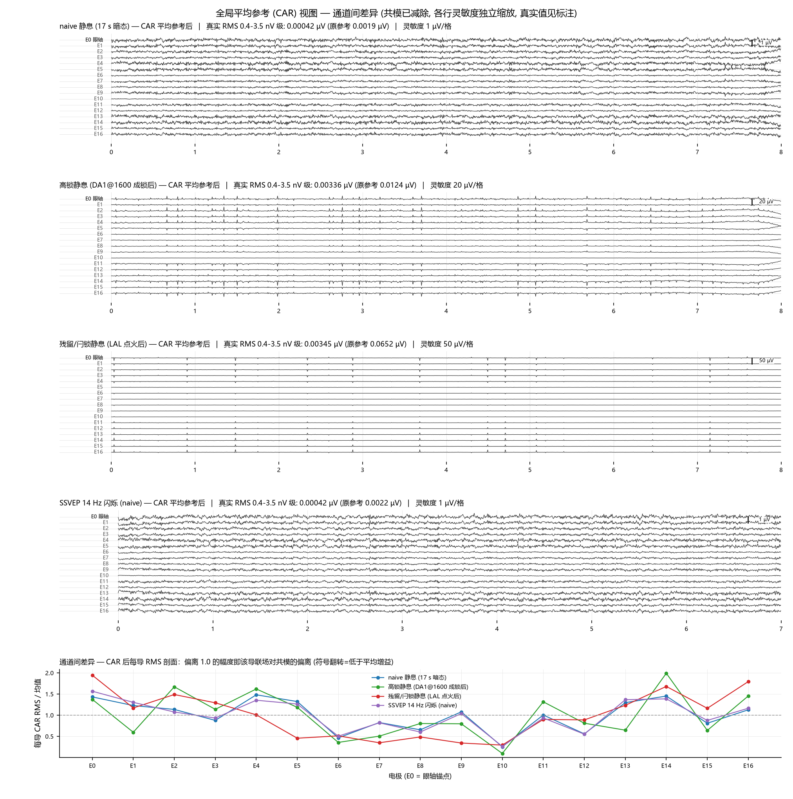

# bci/eegview — 合成脑电第一次时域检查（250 Hz 设备视角）

## 问题

此前所有 condstate/dstate 弧对合成头皮电位只做过频带统计（2-20 Hz
band RMS、SNR、trials-to-d'），**从未把信号本身画成时间序列看过**。
本弧回答四个问题：

1. 合成脑电到底长什么样？
2. 一台 250 Hz 采样率的临床设备采到的是什么？
3. 幅值处于什么量级（要不要缩放、缩放多少）？
4. 像不像脑电？

## 数据（零采集，全部盘上现有，seed 62）

| 臂 | 文件 | 窗口 (ms) | 状态 |
|---|---|---|---|
| naive 静息 | condstate3 ctl62 | [7000,15000] | cs3ctl：17 s 暗态，无任何脉冲 |
| 高锁静息 | condstate4 hl62 | [7000,15000] | DA1@1600 [300,600] 直接成高锁后 |
| 残留/闩锁静息 | condstate3 res62 | [7000,15000] | LAL 点火 [800,2800] + ×0.5 降阻后 |
| SSVEP naive | condstate13 ssvep_naive | [3500,10500] | 14 Hz 全场闪烁稳态 |

头皮记录：17 电极 capped-Fibonacci 布局（通道 0 = 眼轴锚点），原生
1 kHz、V 单位（float32, (T_ms, 17)）。

## 方法

- **设备链**：1 kHz 原生 → 0.5-100 Hz Butterworth(4) 带通（模拟前端
  带宽）→ ÷4 重采样 → **250 Hz**。
- **增益**：统一 ×300 显示增益（把真实亚 µV 信号放到可读幅值），
  每行标题同时标注真实值；复合行不增益。
- **复合行**：真实幅值蝇信号 + 示意人脑背景（幅值 1/f²、0.5-40 Hz、
  2-20 Hz RMS = 11.4 µV 即项目背景模型、85% 空间共享；**合成示意，
  非本仿真产物**）——展示设备记录里蝇信号长什么样。
- 统计：设备带内真实 RMS、2-20 Hz RMS、通道间相关（两两相关均值）、
  1-30 Hz log-log PSD 斜率。

## 结果（outputs/）


### 1. 量级：合成信号是亚 µV 的

| 臂 | 设备带真实 RMS (µV) | 2-20 Hz RMS (µV) | 通道相关 | 斜率 (1-30 Hz) |
|---|---|---|---|---|
| naive 静息 | 0.0019 | 0.0013 | +0.95 | −0.9 |
| 高锁静息 | 0.0124 | 0.0089 | +0.87 | −0.4 |
| 残留/闩锁静息 | 0.0652 | 0.0559 | +1.00 | +0.1 |
| SSVEP naive | 0.0022 | 0.0015 | +0.96 | −0.9 |

**11.4 µV 只是项目的"人脑背景模型"假设值，不是仿真信号的幅值**——
此前各弧的检测账（trials-to-d'）正是在算"亚 µV 蝇信号 vs 11.4 µV
人脑背景"的提取预算。复合行把真实幅值蝇信号叠入 11.4 µV 示意背景：
蝇/背底 ≈ 1/175，**在设备记录里完全不可见**——项目论点的直观版。

状态分层 30×（0.002 → 0.065 µV）与 condstate12 的检测账一致
（残留最响、高锁次之、naive 近乎静默）。

### 2. 形态：状态在时域上有清晰的"脸"

- **残留/闩锁**：稀疏大棘波（癫痫样）——与 sz_l1 同构点火的定性
  一致，间歇期近平坦；
- **高锁**：周期性尖瞬变（~0.7 s 间隔）叠加低幅活动；
- **naive / SSVEP**：低幅密集活动，宽带下 14 Hz 节律**不可见**；
- **SSVEP 12-16 Hz 带通后**：14 Hz 节律时域清晰可见（71 ms/周期，
  时强时弱包络，像真实的稳态响应）——与 condstate13"SSVEP 只能
  频域提取"的结论互证；
- **复合行**：+示意背景后完全就是一张正常 EEG 记录页——蝇信号
  不可见。

### 2b. 全局平均参考（CAR）：通道间差异有多大

原始参考下通道相关 +0.87~+1.00 的目测印象（"所有通道都长得
一样"）用 CAR 定量复核：每时刻减 17 导均值，共模即被减除。



| 臂 | 共模占比 | CAR 后 RMS (µV) | CAR 后通道相关 |
|---|---|---|---|
| naive 静息 | 95.1% | 0.00042 | −0.06 |
| 高锁静息 | 87.0% | 0.00336 | −0.06 |
| 残留/闩锁静息 | 99.7% | 0.00345 | −0.06 |
| SSVEP naive | 96.2% | 0.00042 | −0.06 |

- **共模占绝对主导（87-99.7%）**——目测正确；来源是源几何：单个
  紧凑果蝇脑 through 头模型，每导只差一个平滑导联场增益。
- **CAR 后通道相关 ≈ 0（−0.06）**，每导只剩 0.4-3.5 nV 级差异信号；
  残留态的大棘波在 CAR 页上只落在少数导（焦场）——点火波并非
  全体积严格同步。
- **CAR 后每导 RMS 剖面四臂重合**（E4/E14 峰、E6-E9 谷、±2× 于
  均值）——差异花纹是**导联场几何**，与状态无关；E0 眼轴锚并不是
  CAR 峰。
- **实践含义（对项目）**：对"单一紧凑源"几何，CAR 是错误的参考
  选择——它减掉的恰是信号本身（0.4-3.5 nV vs 原始 2-65 µV）。真实
  设备应保留共模，用最佳单导或双极导联；CAR 的适用前提（分布式
  源、平均为噪声）在人脑上成立、在蝇头上不成立。通道高相关由此
  定性：不是缺陷，是源几何的必然。

### 2c. 追问：尖峰从哪来 / SSVEP 过 CAR 还剩什么（qa_spikes.py）

**Q1 为什么高锁/残留闩锁多尖峰、naive 像脑电？**

| 臂 | ALPN | KC | MBON | 峭度 | p2p/RMS | >4σ 事件/s | 共模主节律 |
|---|---|---|---|---|---|---|---|
| naive 静息 | **0.0** | **0.0** | **0.0** | 0.0 | 1.16 | 0.0 | 1.7 Hz |
| 高锁静息 | **98.6** | 3.9 | 6.1 | 4.8 | 1.52 | 1.4 | 10.7 Hz |
| 残留/闩锁静息 | 99.1 | 17.2 | 22.1 | **62.8** | 2.16 | 3.6 | 3.7 Hz |
| SSVEP naive | 0.0 | 0.0 | 0.0 | −0.2 | 1.10 | 0.0 | 13.9 Hz |

- **naive/SSVEP 臂四个记录池全部 0 Hz**——中央脑在暗态/纯视觉驱动
  下完全静默；平滑的"脑电样"底 = 未记录的外周/局部自发（视觉通路、
  AL 局部神经元），活动源少且去同步 → 高斯样（峭度≈0）。
- **高锁**：触角叶自持 ~99 Hz（锁本体）——一个紧凑、快速、振荡
  （共模主节律 10.7 Hz）的群体，每次群体齐射就是一个尖锐瞬变 →
  峭度 4.8、离散 1.4/s 事件。
- **残留/闩锁**：点火后 KC(17)/MBON(22) 招募上线 → 偶发大规模
  集中放电 → 峭度 **62.8**（稀有巨事件）、3.6/s、主节律 3.7 Hz。
- 归因诚实边界：共模尖峰时刻对四个记录池的事件触发平均（ETA）
  均 <1z——**确切产棘波群不在记录集里**（推测 AL 局部神经元/板层
  快群体）；但状态级对照（池静默→平滑 vs AL 炽热→尖峰化）是稳的。

**Q2 SSVEP 过 CAR 后还有 14 Hz 吗？**——**有**。14 Hz 幅值
0.7 → 0.1 nV（×6.9 衰减），带 SNR（f0±1 bin vs 2-40 Hz 中位）
**+11.7 → +8.1 dB**，仍高于静息臂的假阳性地板（+4.9/+3.3 dB）。
CAR 页上"看着像静息"只是因为 CAR 后一切都在 nV 级，不是节律消失。
250 Hz 设备链（Nyquist 125 Hz）对 14 Hz 无任何损失。

**Q3 正常 SSVEP 分类是不是不能做 CAR？**——人脑上 CAR 不是 SSVEP
标准流程（常规为耳垂/乳突/枕参考 + 窄带滤波或 CCA；CAR 多用于
ERP/运动想象），但人脑用了通常也无大碍——SSVEP 源是枕叶分布式，
不是纯共模。**蝇头上则是明确有害**：源紧凑 → 信号 96% 是共模，
CAR 白白砍掉 ×6.9 的 14 Hz 幅值，残量 0.1 nV 在 11.4 µV 设备背景
下完全不可测。结论：技术可行、方案上不该做——单紧凑源用原始
参考/最佳单导/双极。（注：仿真内 SNR 是无背景计算的；0.7 nV 的
原始幅值本身也已低于真实设备底——项目主线论点。）

### 3. 频谱与空间：两处明确"不像"

- **谱形太平**：naive 斜率 −0.9，人头皮 EEG 典型 −2~−3（1/f³）——
  群体尖峰驱动的源相对富含高频，四球头模型衰减不足以把谱压成人脑
  形状；
- **空间过相关**：通道间相关 +0.87~+1.00（人脑典型 0.3-0.7）——
  源是单一果蝇脑的少数偶极子组，空间自由度远低于人脑分布式活动
  （CAR 复核见 §2b：共模 87-99.7%，减除后相关归零）。

## 像不像（判读）

**像**：µV 量级的幅值动力学、状态间 30× 分层、棘波/尖波/节律的
形态学、带通后 SSVEP 的经典形貌。
**不像**：谱形平坦（高频偏多）、通道间过相关（源维度低）、以及
不含人脑自身背景（真实设备里 11.4 µV 背景把蝇信号埋 175×）。

## 限制

- 单种子（seed 62）；窗口为各臂稳态段的手选代表窗。
- 示意人脑背景为合成噪声（1/f²、85% 共享），仅用于"设备视角"
  演示行，非本仿真产物，已逐行标注。
- ×300 显示增益仅为可读性；所有统计与标注均为真实值。
- 电极布局是 capped-Fibonacci（无 10-20 命名），与真实帽的导联
  对应关系未定标。

## 复现

```bash
# conda ffbm, repo root
python bci/eegview/make_fig.py
# -> outputs/eegwave_250hz.png, outputs/eegwave_250hz_car.png,
#    outputs/psd_250hz.png, outputs/stats.json
```
